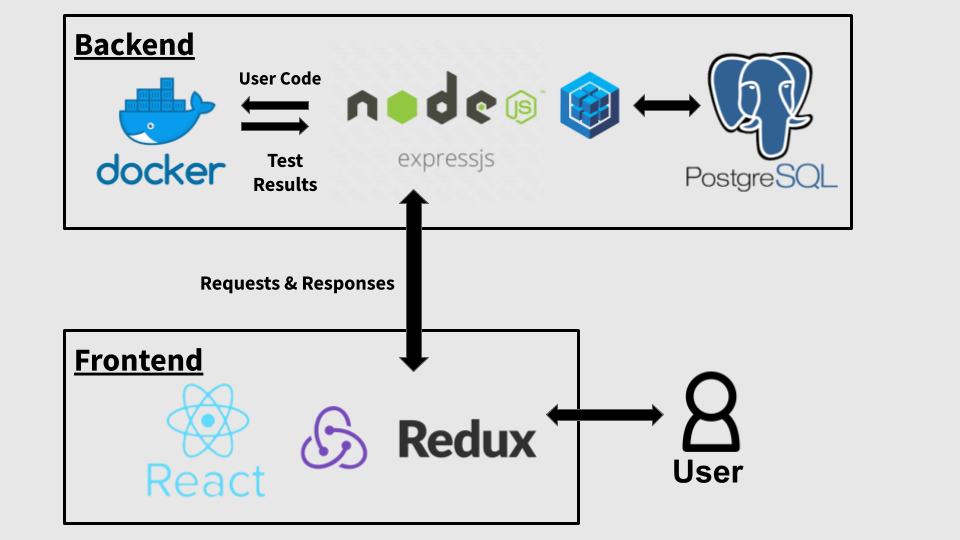

Schema:
https://drive.google.com/file/d/1ZEx9gmbQdgiOGQtXB2nr0ovRRA6ft3Pj/view?usp=sharing

Wireframe:
https://www.figma.com/file/Ru4wXyFKdDKBWKkrhuiROp/Untitled?node-id=0%3A1

## Technology Stack & Tools

[Hop Hop] Array implements the NERDS (Node, Express, React, Database using SQL) stack. Each technology was specifically selected to complement and enhance the web application.

**Backend**

_PosgreSQL_ is one of the most popular relational databases. It allowed us to effectively create the association between the user and algorithm models. This was necessary in order to store information on the specific code each user submits for each algorithm.

_Express_ was selected because of its RESTful API. This allows [Hop Hop] Array to handle the load of requests and responses created every time a user attempts to submit code and the pass and fail results are returned.

**Frontend**

_React Redux_ was used to manage our applications state. This was beneficial to store user information in the state as a logged in user navigated through the website and attempted/ completed algorithms. In addition, this declarative class driven approach allowed the team to efficiently manage our frontend components.

**Other Technologies**

_Docker_ was a key part of our web application that provided necessary security. Every time a user submits code, a new Docker container is created with that code, along with the corresponding Mocha test specs. The user code is run against the test specs in that Docker container and the pass and fail results are returned. The Docker container protects our server if a user were to submit malicious code, as the user code is being run in an isolated environment.

_Monaco Editor_ is created by Microsoft and is the code editor that powers VS Code. It is open source and under the MIT license. It supports syntax highlighting, bracket matching, and intellisense. It also supports color themes. We used fairyfloss for the editor on our website.

## OAuth Set Up

[Hop Hop] Array offers three options for a user to login: a [Hop Hop] Array account, Google, and Github.

The following variables need to be defined in your system environment in order for the Google OAuth and Github OAuth to be set up:

* GOOGLE_CLIENT_ID
* GOOGLE_CLIENT_SECRET
* GOOGLE_CALLBACK

* GITHUB_CLIENT_ID
* GITHUB_CLIENT_SECRET
* GITHUB_CALLBACK

**Google**

Please see the below for Google's documentation for configuring Google OAuth:

[Link](https://developers.google.com/identity/protocols/OAuth2)

**Github**

Please see the below to set up an OAuth App within Github:

[Link](https://github.com/settings/developers)
