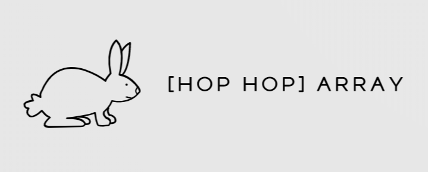

##

[Hop Hop] Array is a web application for practicing coding algorithms. Users attempt to submit code to be run against test specs; as well as gain points and experience levels for correct solutions.

Schema:
https://drive.google.com/file/d/1ZEx9gmbQdgiOGQtXB2nr0ovRRA6ft3Pj/view?usp=sharing

Wireframe:
https://www.figma.com/file/Ru4wXyFKdDKBWKkrhuiROp/Untitled?node-id=0%3A1

## Setup

We used the boilermaker linked below as the base of our project and built off it. Please follow the setup instructions in the link.
https://github.com/FullstackAcademy/boilermaker

## Technology Stack & Tools

[Hop Hop] Array implements the NERDS (Node, Express, React, Database using SQL) stack. Each technology was specifically selected to complement and enhance the web application.

**Backend**

_PosgreSQL_ is one of the most popular relational databases. It allowed us to effectively create the association between the user and algorithm models. This was necessary in order to store information on the specific code each user submits for each algorithm.

_Express_ was selected because of its RESTful API. This allows [Hop Hop] Array to handle the load of requests and responses created every time a user attempts to submit code and the pass and fail results are returned.

**Frontend**

_React Redux_ was used to manage our applications state. This was beneficial to store user information in the state as a logged in user navigated through the website and attempted/ completed algorithms. In addition, this declarative class driven approach allowed the team to efficiently manage our frontend components.

**Other Technologies**

_Docker_ was a key part of our web application that provided necessary security. Every time a user submits code, a new Docker container is created with that code, along with the corresponding Mocha test specs. The user code is run against the test specs in that Docker container and the pass and fail results are returned. The Docker container protects our server if a user were to submit malicious code, as the user code is being run in an isolated environment.

## Schema

Below is our finalized schema:

We followed the DRY approach, as UserAlgos acted as a through-table between Algos and Users.

## Deployment

To deploy our web application, we had to limit our options given our use of Docker and the budget we set for ourselves. With those factors in mind, we found that either AWS or Scaleway was the ideal deployment source for our product.

We then went ahead and purchased a virtual machine from Scaleway and used its public IP address, and our DNS on NameCheap.

If you choose to use our method of deployment, please note, you will need to ssh into your server from your terminal, reconfigure your dB, Docker, and your OAuth secrets. Please review https://www.scaleway.com/en/docs/create-and-connect-to-your-server/ for more details.
